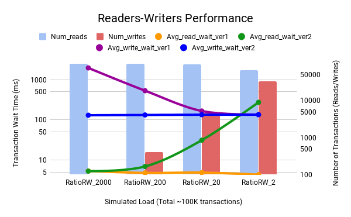

# Reader-Writers Problem

## Overview

1. Version 1 - Readers are prioritized, writers are allowed to starve
1. Version 2 - Writers are prioritized, readers are allowed to starve
1. Version 3 - No starvation

## Experimentation

The chart below is generated by measuring the wait times experienced by each
read/write transaction in the version 1 and version 2 of the readers-writers
problem.

* The ratio of reads-to-writes is varied -- from 2 to 2000 -- keeping
the total number of transactions approximately constant (~100K transactions)
* The reads are generated by 200 reader threads and the writes are generated
by 100 writer threads, each thread simulating I/O by sleeping for a small
duration (writers sleep twice as long as readers in these experiments)

The number of reads and writes are depicted as columns (right X-axis) while
the read and write wait times are shown as lines (left Y-axis).



**_It can be seen that, on average, the reads (orange line) get serviced
within a fairly constant amount of time in version 1 while the writes (blue line)
get serviced within a fairly constant amount of time in version 2._** As a
consequence, writes get starved in the former case while reads get
starved in the latter.

## Appendix
Run the readers-writers testcase as:

```
% python3 reader_writer_tests.py
```

